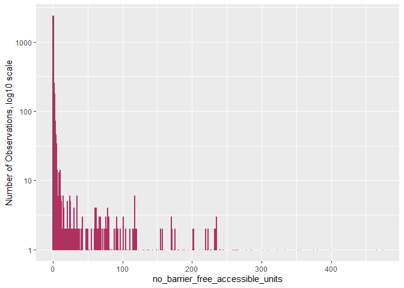
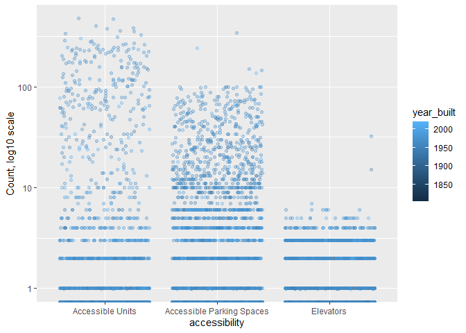
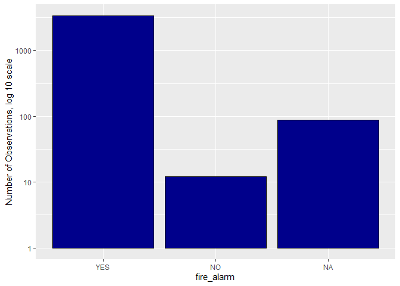
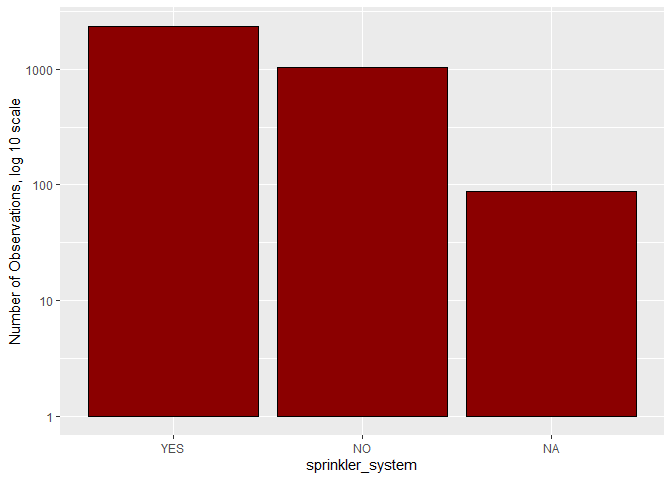
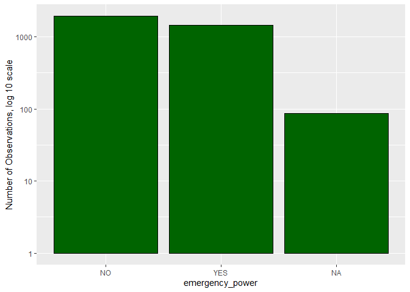
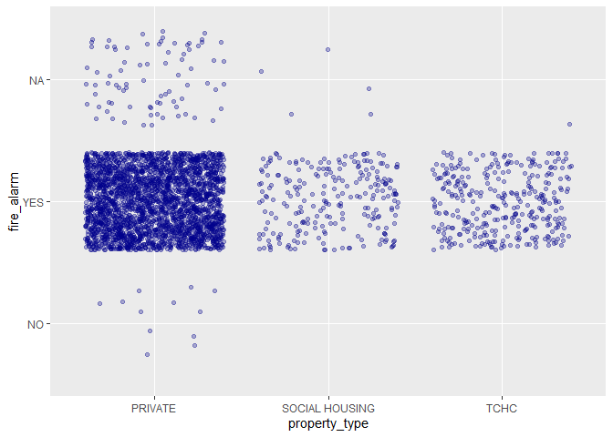
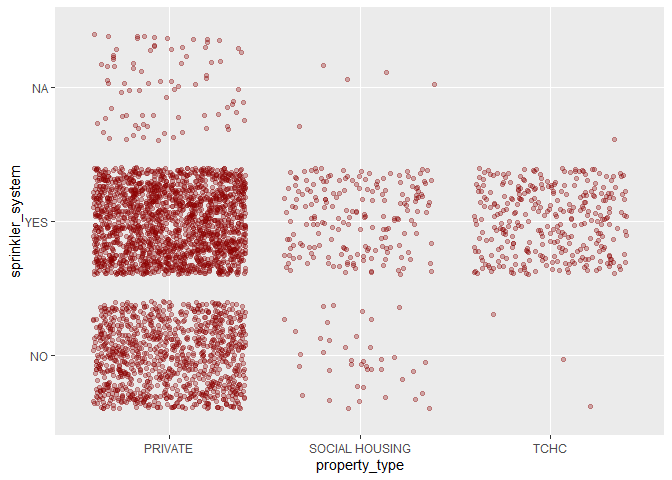
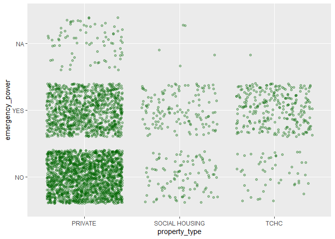

Mini Data Analysis Milestone 2
================

*To complete this milestone, you can either edit [this `.rmd`
file](https://raw.githubusercontent.com/UBC-STAT/stat545.stat.ubc.ca/master/content/mini-project/mini-project-2.Rmd)
directly. Fill in the sections that are commented out with
`<!--- start your work here--->`. When you are done, make sure to knit
to an `.md` file by changing the output in the YAML header to
`github_document`, before submitting a tagged release on canvas.*

# Welcome to the rest of your mini data analysis project!

In Milestone 1, you explored your data and came up with research
questions. This time, we will finish up our mini data analysis and
obtain results for your data by:

- Making summary tables and graphs
- Manipulating special data types in R: factors and/or dates and times.
- Fitting a model object to your data, and extract a result.
- Reading and writing data as separate files.

We will also explore more in depth the concept of *tidy data.*

**NOTE**: The main purpose of the mini data analysis is to integrate
what you learn in class in an analysis. Although each milestone provides
a framework for you to conduct your analysis, it’s possible that you
might find the instructions too rigid for your data set. If this is the
case, you may deviate from the instructions – just make sure you’re
demonstrating a wide range of tools and techniques taught in this class.

# Instructions

**To complete this milestone**, edit [this very `.Rmd`
file](https://raw.githubusercontent.com/UBC-STAT/stat545.stat.ubc.ca/master/content/mini-project/mini-project-2.Rmd)
directly. Fill in the sections that are tagged with
`<!--- start your work here--->`.

**To submit this milestone**, make sure to knit this `.Rmd` file to an
`.md` file by changing the YAML output settings from
`output: html_document` to `output: github_document`. Commit and push
all of your work to your mini-analysis GitHub repository, and tag a
release on GitHub. Then, submit a link to your tagged release on canvas.

**Points**: This milestone is worth 50 points: 45 for your analysis, and
5 for overall reproducibility, cleanliness, and coherence of the Github
submission.

**Research Questions**: In Milestone 1, you chose two research questions
to focus on. Wherever realistic, your work in this milestone should
relate to these research questions whenever we ask for justification
behind your work. In the case that some tasks in this milestone don’t
align well with one of your research questions, feel free to discuss
your results in the context of a different research question.

# Learning Objectives

By the end of this milestone, you should:

- Understand what *tidy* data is, and how to create it using `tidyr`.
- Generate a reproducible and clear report using R Markdown.
- Manipulating special data types in R: factors and/or dates and times.
- Fitting a model object to your data, and extract a result.
- Reading and writing data as separate files.

# Setup

Begin by loading your data and the tidyverse package below:

``` r
library(datateachr)
library(tidyverse)
library(ggplot2)
library(dplyr)
library(lubridate)
library(forcats)
```

# Task 1: Process and summarize your data

From milestone 1, you should have an idea of the basic structure of your
dataset (e.g. number of rows and columns, class types, etc.). Here, we
will start investigating your data more in-depth using various data
manipulation functions.

### 1.1 (1 point)

First, write out the 4 research questions you defined in milestone 1
were. This will guide your work through milestone 2:

<!-------------------------- Start your work below ---------------------------->

1.  How accessible are these apartment buildings for people with
    disabilities?
2.  Does the overall accessibility of these apartment buildings change
    in comparison to when they were built?
3.  Is there a relation between the kind of amenities (if any) and the
    year the apartment building was built?
4.  Does the property type influence the number of safety features
    within the apartment building / is there a relation between the
    property type and the number of safety features?
    <!----------------------------------------------------------------------------->

Here, we will investigate your data using various data manipulation and
graphing functions.

### 1.2 (8 points)

Now, for each of your four research questions, choose one task from
options 1-4 (summarizing), and one other task from 4-8 (graphing). You
should have 2 tasks done for each research question (8 total). Make sure
it makes sense to do them! (e.g. don’t use a numerical variables for a
task that needs a categorical variable.). Comment on why each task helps
(or doesn’t!) answer the corresponding research question.

Ensure that the output of each operation is printed!

Also make sure that you’re using dplyr and ggplot2 rather than base R.
Outside of this project, you may find that you prefer using base R
functions for certain tasks, and that’s just fine! But part of this
project is for you to practice the tools we learned in class, which is
dplyr and ggplot2.

**Summarizing:**

1.  Compute the *range*, *mean*, and *two other summary statistics* of
    **one numerical variable** across the groups of **one categorical
    variable** from your data. (**Questions 1 and 3 from below**)
2.  Compute the number of observations for at least one of your
    categorical variables. Do not use the function `table()`!
    (**Question 4 from below**)
3.  Create a categorical variable with 3 or more groups from an existing
    numerical variable. You can use this new variable in the other
    tasks! *An example: age in years into “child, teen, adult, senior”.*
    (**Question 2 from below**)
4.  Compute the proportion and counts in each category of one
    categorical variable across the groups of another categorical
    variable from your data. Do not use the function `table()`!

**Graphing:**

6.  Create a graph of your choosing, make one of the axes logarithmic,
    and format the axes labels so that they are “pretty” or easier to
    read. (**Questions 1 and 3 from below**)
7.  Make a graph where it makes sense to customize the alpha
    transparency. (**Questions 2 and 4 from below**)

Using variables and/or tables you made in one of the “Summarizing”
tasks:

8.  Create a graph that has at least two geom layers.
9.  Create 3 histograms, with each histogram having different sized
    bins. Pick the “best” one and explain why it is the best.

Make sure it’s clear what research question you are doing each operation
for!

<!------------------------- Start your work below ----------------------------->

# Report Introduction

Hello, my name is Bradley Hoskin, and I am making a report that analyzes
the *apt_buildings* dataset. I will mainly be using *tidyverse*,
*dplyr*, *forcats*, and *ggplot2* package functions in this report. This
report’s goal is to try and assess the overall accessibility of the
apartments within the *apt_building* dataset, as well as explore the
types of features and amenities these apartment buildings have. This
report will try and answer four high-interest questions for my clients,
who are looking for an investment property with impeccable safety
features and a high level of accessibility from within the
*apt_buildings* dataset.

These four questions have been changed and updated by my clients since
the first report. The original four questions are above under section
1.1, however the adjusted four main questions for this project are:

1.  How accessible are these apartment buildings for people with
    disabilities?
2.  Does the overall accessibility of these apartment buildings change
    in comparison to when they were built?
3.  How safe are these apartments?
4.  Does the property type influence the number of safety features
    within the apartment building / is there a relation between the
    property type and the number of safety features?

This report will contain both explanations of my code, as well as
explanations of the figures and visuals of the data within this report.

# Dataset and Libraries

The necessary packages needed for this report are below. I highly
recommend loading these packages, or installing and then loading them if
you do not have these packages already installed. This will allow you to
run my code and reproduce the results in this report. The dataset
*apt_buildings* is contained within the *datateachr* package.

``` r
library(datateachr)
library(tidyverse)
library(ggplot2)
library(dplyr)
library(lubridate)
library(forcats)
library(broom)
library(here)
```

    ## here() starts at C:/Users/bradh/OneDrive/Documents/mda-bhoskin

# Introduction of the Dataset

As per my last report, the *apt_buildings* dataset was explored in depth
using *dplyr* and *ggplot2* functions to analyze the overall safety of
the apartment buildings. Below I have used the *glimpse* and *class*
functions to give a quick refresher of the dataset for those who may
have read my previous report some time ago.

``` r
apt_buildings %>%
  glimpse() %>%
  class()
```

    ## Rows: 3,455
    ## Columns: 37
    ## $ id                               <dbl> 10359, 10360, 10361, 10362, 10363, 10…
    ## $ air_conditioning                 <chr> "NONE", "NONE", "NONE", "NONE", "NONE…
    ## $ amenities                        <chr> "Outdoor rec facilities", "Outdoor po…
    ## $ balconies                        <chr> "YES", "YES", "YES", "YES", "NO", "NO…
    ## $ barrier_free_accessibilty_entr   <chr> "YES", "NO", "NO", "YES", "NO", "NO",…
    ## $ bike_parking                     <chr> "0 indoor parking spots and 10 outdoo…
    ## $ exterior_fire_escape             <chr> "NO", "NO", "NO", "YES", "NO", NA, "N…
    ## $ fire_alarm                       <chr> "YES", "YES", "YES", "YES", "YES", "Y…
    ## $ garbage_chutes                   <chr> "YES", "YES", "NO", "NO", "NO", "NO",…
    ## $ heating_type                     <chr> "HOT WATER", "HOT WATER", "HOT WATER"…
    ## $ intercom                         <chr> "YES", "YES", "YES", "YES", "YES", "Y…
    ## $ laundry_room                     <chr> "YES", "YES", "YES", "YES", "YES", "Y…
    ## $ locker_or_storage_room           <chr> "NO", "YES", "YES", "YES", "NO", "YES…
    ## $ no_of_elevators                  <dbl> 3, 3, 0, 1, 0, 0, 0, 2, 4, 2, 0, 2, 2…
    ## $ parking_type                     <chr> "Underground Garage , Garage accessib…
    ## $ pets_allowed                     <chr> "YES", "YES", "YES", "YES", "YES", "Y…
    ## $ prop_management_company_name     <chr> NA, "SCHICKEDANZ BROS. PROPERTIES", N…
    ## $ property_type                    <chr> "PRIVATE", "PRIVATE", "PRIVATE", "PRI…
    ## $ rsn                              <dbl> 4154812, 4154815, 4155295, 4155309, 4…
    ## $ separate_gas_meters              <chr> "NO", "NO", "NO", "NO", "NO", "NO", "…
    ## $ separate_hydro_meters            <chr> "YES", "YES", "YES", "YES", "YES", "Y…
    ## $ separate_water_meters            <chr> "NO", "NO", "NO", "NO", "NO", "NO", "…
    ## $ site_address                     <chr> "65  FOREST MANOR RD", "70  CLIPPER R…
    ## $ sprinkler_system                 <chr> "YES", "YES", "NO", "YES", "NO", "NO"…
    ## $ visitor_parking                  <chr> "PAID", "FREE", "UNAVAILABLE", "UNAVA…
    ## $ ward                             <chr> "17", "17", "03", "03", "02", "02", "…
    ## $ window_type                      <chr> "DOUBLE PANE", "DOUBLE PANE", "DOUBLE…
    ## $ year_built                       <dbl> 1967, 1970, 1927, 1959, 1943, 1952, 1…
    ## $ year_registered                  <dbl> 2017, 2017, 2017, 2017, 2017, NA, 201…
    ## $ no_of_storeys                    <dbl> 17, 14, 4, 5, 4, 4, 4, 7, 32, 4, 4, 7…
    ## $ emergency_power                  <chr> "NO", "YES", "NO", "NO", "NO", "NO", …
    ## $ `non-smoking_building`           <chr> "YES", "NO", "YES", "YES", "YES", "NO…
    ## $ no_of_units                      <dbl> 218, 206, 34, 42, 25, 34, 14, 105, 57…
    ## $ no_of_accessible_parking_spaces  <dbl> 8, 10, 20, 42, 12, 0, 5, 1, 1, 6, 12,…
    ## $ facilities_available             <chr> "Recycling bins", "Green Bin / Organi…
    ## $ cooling_room                     <chr> "NO", "NO", "NO", "NO", "NO", "NO", "…
    ## $ no_barrier_free_accessible_units <dbl> 2, 0, 0, 42, 0, NA, 14, 0, 0, 1, 25, …

    ## [1] "tbl_df"     "tbl"        "data.frame"

As you can see, many of the categorical variables or columns of the
*apt_buildings* dataset are character columns (shown as “chr” above). In
order for me to answer the four high-interest questions for my client, I
first had to convert the character columns into factor columns, and did
so using the *mutate_if* function below. I then renamed this new dataset
with factor columns as *apt_b* to differentiate it from the
*apt_buildings* dataset without factor columns. I then used the
*glimpse* function to show the new dataset below. Converting the
character variables into factor variables makes them much easier to
analyze using the package functions I mentioned in the Dataset and
Libraries section. The factor columns can be observed as “fct” below.

``` r
apt_b <- mutate_if(apt_buildings, is.character, as.factor)
glimpse(apt_b)
```

    ## Rows: 3,455
    ## Columns: 37
    ## $ id                               <dbl> 10359, 10360, 10361, 10362, 10363, 10…
    ## $ air_conditioning                 <fct> NONE, NONE, NONE, NONE, NONE, NONE, N…
    ## $ amenities                        <fct> "Outdoor rec facilities", "Outdoor po…
    ## $ balconies                        <fct> YES, YES, YES, YES, NO, NO, NO, YES, …
    ## $ barrier_free_accessibilty_entr   <fct> YES, NO, NO, YES, NO, NO, YES, NO, YE…
    ## $ bike_parking                     <fct> 0 indoor parking spots and 10 outdoor…
    ## $ exterior_fire_escape             <fct> NO, NO, NO, YES, NO, NA, NO, NO, NO, …
    ## $ fire_alarm                       <fct> YES, YES, YES, YES, YES, YES, YES, YE…
    ## $ garbage_chutes                   <fct> YES, YES, NO, NO, NO, NO, NO, YES, YE…
    ## $ heating_type                     <fct> HOT WATER, HOT WATER, HOT WATER, HOT …
    ## $ intercom                         <fct> YES, YES, YES, YES, YES, YES, YES, YE…
    ## $ laundry_room                     <fct> YES, YES, YES, YES, YES, YES, YES, YE…
    ## $ locker_or_storage_room           <fct> NO, YES, YES, YES, NO, YES, YES, YES,…
    ## $ no_of_elevators                  <dbl> 3, 3, 0, 1, 0, 0, 0, 2, 4, 2, 0, 2, 2…
    ## $ parking_type                     <fct> "Underground Garage , Garage accessib…
    ## $ pets_allowed                     <fct> YES, YES, YES, YES, YES, YES, YES, YE…
    ## $ prop_management_company_name     <fct> NA, "SCHICKEDANZ BROS. PROPERTIES", N…
    ## $ property_type                    <fct> PRIVATE, PRIVATE, PRIVATE, PRIVATE, P…
    ## $ rsn                              <dbl> 4154812, 4154815, 4155295, 4155309, 4…
    ## $ separate_gas_meters              <fct> NO, NO, NO, NO, NO, NO, NO, NO, NO, N…
    ## $ separate_hydro_meters            <fct> YES, YES, YES, YES, YES, YES, YES, YE…
    ## $ separate_water_meters            <fct> NO, NO, NO, NO, NO, NO, NO, NO, NO, N…
    ## $ site_address                     <fct> 65  FOREST MANOR RD, 70  CLIPPER RD, …
    ## $ sprinkler_system                 <fct> YES, YES, NO, YES, NO, NO, NO, YES, Y…
    ## $ visitor_parking                  <fct> PAID, FREE, UNAVAILABLE, UNAVAILABLE,…
    ## $ ward                             <fct> 17, 17, 03, 03, 02, 02, 02, 02, 13, 0…
    ## $ window_type                      <fct> DOUBLE PANE, DOUBLE PANE, DOUBLE PANE…
    ## $ year_built                       <dbl> 1967, 1970, 1927, 1959, 1943, 1952, 1…
    ## $ year_registered                  <dbl> 2017, 2017, 2017, 2017, 2017, NA, 201…
    ## $ no_of_storeys                    <dbl> 17, 14, 4, 5, 4, 4, 4, 7, 32, 4, 4, 7…
    ## $ emergency_power                  <fct> NO, YES, NO, NO, NO, NO, NO, YES, NO,…
    ## $ `non-smoking_building`           <fct> YES, NO, YES, YES, YES, NO, NO, YES, …
    ## $ no_of_units                      <dbl> 218, 206, 34, 42, 25, 34, 14, 105, 57…
    ## $ no_of_accessible_parking_spaces  <dbl> 8, 10, 20, 42, 12, 0, 5, 1, 1, 6, 12,…
    ## $ facilities_available             <fct> Recycling bins, Green Bin / Organics,…
    ## $ cooling_room                     <fct> NO, NO, NO, NO, NO, NO, NO, NO, NO, N…
    ## $ no_barrier_free_accessible_units <dbl> 2, 0, 0, 42, 0, NA, 14, 0, 0, 1, 25, …

# Analysis of Questions

The four high-priority questions shown above will be answered through
the analysis of the dataset in this section. Explanations of the code,
and interpretations of the data will be given for each question.

### Question 1

The first question my clients are interested in is how accessible are
the apartment buildings in the *apt_building* dataset. In order to
address accessibility, I first wanted to see what the distribution of
the number of barrier-free, accessible units in the apartment buildings.
To do this, I used the *ggplot* and *geom_bar* functions to create a bar
graph. I put the *no_barrier_free_accessible_units* column on the
x-axis, and the number of observations on the y-axis. I also put the
y-axis on a logarithmic scale using the *scale_y_log10* function to
create an easier-to-read graph. This plot can be seen below, and
visually shows that the majority of apartment buildings in the dataset
do not have any barrier-free accessible units.

``` r
apt_b %>%
  ggplot(aes(x = no_barrier_free_accessible_units)) +
  geom_bar(colour = 'maroon') +
  scale_y_log10("Number of Observations, log10 scale")
```

    ## Warning: Removed 154 rows containing non-finite values (`stat_count()`).

<!-- -->

To confirm this, I did some statistical analyses of the
*no_barrier_free_accessible_units* column. I used the *median*, *mean*,
*range* and *sd* functions to calculate the median, average, range, and
standard deviation of column in the apartment buildings from the
dataset. This showed that the average number of barrier-free accessible
units was around 9 in the *apt_buildings* dataset, however the median
showed the true middle number is actually 0 barrier-free accessible
units. The range is quite large, from 0 barrier-free accessible units
(which the majority of apartments are) and 474. Having a large range
explains why the standard deviation would also be quite large, being at
almost 40. However, this only somewhat answers Question 1, but doesn’t
it completely. We only looked at the statistical analysis of **one**
variable concerning accessibility. In order to fully answer Question 1,
we would have to analyze the data of all possible variables or columns
from the dataset that are related to accessibility, such as the
*no_of_accessible_parking_spaces*, *no_of_elevators*, and
*barrier_free_accessibility_entr* variables. This analysis did not do
that.

``` r
apt_b %>% 
  summarise(no_barrier_free_accessible_units_median = median(`no_barrier_free_accessible_units`, na.rm = TRUE))
```

    ## # A tibble: 1 × 1
    ##   no_barrier_free_accessible_units_median
    ##                                     <dbl>
    ## 1                                       0

``` r
apt_b %>%
  summarise(no_barrier_free_accessible_units_mean = mean(`no_barrier_free_accessible_units`, na.rm = TRUE))
```

    ## # A tibble: 1 × 1
    ##   no_barrier_free_accessible_units_mean
    ##                                   <dbl>
    ## 1                                  9.41

``` r
apt_b %>%
  reframe(no_barrier_free_accessible_units_range = range(`no_barrier_free_accessible_units`, na.rm = TRUE))
```

    ## # A tibble: 2 × 1
    ##   no_barrier_free_accessible_units_range
    ##                                    <dbl>
    ## 1                                      0
    ## 2                                    474

``` r
apt_b %>%
  reframe(no_barrier_free_accessible_units_sd = sd(`no_barrier_free_accessible_units`, na.rm = TRUE))
```

    ## # A tibble: 1 × 1
    ##   no_barrier_free_accessible_units_sd
    ##                                 <dbl>
    ## 1                                39.6

### Question 2

Question 2 is trying to find if there is a relationship between the
overall accessibility of the apartment buildings from the
*apt_buildings* dataset and the year it was built. In order to do this,
I had to tidy my dataset using the *pivot_longer* function to combine
the *no_barrier_free_accessible_units*,
*no_of_accessible_parking_spaces*, and *no_of_elevators* into a new
column called *accessibility*. The numerical information of the original
columns went into a new column called *accessibility_count*. I called
the new tidy tibble that was produced with the combined column thr
*long_accessibility_tibble*. I used the *print* function to print the
new *long_accessibility_tibble*. From there, I used the *mutate* and
*fct_recode* functions to rename the columns to make them more
aesthetically pleasing in the plot I created just after.

I used the functions *ggplot* and *geom_jitter* to create a plot that
compares the *accessibility* column on the x-axis, and the
*accessibility_count* column on the y-axis. In this plot, the year the
apartment building was built is defined by the colour. I also changed
the alpha for this graph, which alters the transparecny of the data
points so that the data doesn’t obscue itself. I also put the y-axis on
a logarithmic scale to better visualize the *accessibility_count* column
on the y-axis. From the plot below, we can see that there is a trend
that newer buildings are much more likely to contain more accessibility
features, such as more elevators, more barrier-free accessible units,
and more accessible parking spots. This answers Question 2.

``` r
long_accessibility_tibble <- apt_b %>%
  pivot_longer(c(no_barrier_free_accessible_units, no_of_accessible_parking_spaces, no_of_elevators),
               names_to = "accessibility",
               values_to = "accessibility_count")
print(long_accessibility_tibble)
```

    ## # A tibble: 10,365 × 36
    ##       id air_conditioning amenities             balconies barrier_free_accessi…¹
    ##    <dbl> <fct>            <fct>                 <fct>     <fct>                 
    ##  1 10359 NONE             Outdoor rec faciliti… YES       YES                   
    ##  2 10359 NONE             Outdoor rec faciliti… YES       YES                   
    ##  3 10359 NONE             Outdoor rec faciliti… YES       YES                   
    ##  4 10360 NONE             Outdoor pool          YES       NO                    
    ##  5 10360 NONE             Outdoor pool          YES       NO                    
    ##  6 10360 NONE             Outdoor pool          YES       NO                    
    ##  7 10361 NONE             <NA>                  YES       NO                    
    ##  8 10361 NONE             <NA>                  YES       NO                    
    ##  9 10361 NONE             <NA>                  YES       NO                    
    ## 10 10362 NONE             <NA>                  YES       YES                   
    ## # ℹ 10,355 more rows
    ## # ℹ abbreviated name: ¹​barrier_free_accessibilty_entr
    ## # ℹ 31 more variables: bike_parking <fct>, exterior_fire_escape <fct>,
    ## #   fire_alarm <fct>, garbage_chutes <fct>, heating_type <fct>, intercom <fct>,
    ## #   laundry_room <fct>, locker_or_storage_room <fct>, parking_type <fct>,
    ## #   pets_allowed <fct>, prop_management_company_name <fct>,
    ## #   property_type <fct>, rsn <dbl>, separate_gas_meters <fct>, …

``` r
long_accessibility_tibble %>%
  mutate(accessibility = accessibility %>% 
           fct_recode("Accessible Units" = "no_barrier_free_accessible_units")) %>%
  mutate(accessibility = accessibility %>%
           fct_recode("Accessible Parking Spaces" = "no_of_accessible_parking_spaces")) %>%
  mutate(accessibility = accessibility %>%
           fct_recode("Elevators" = "no_of_elevators")) %>%
  ggplot(aes(x = accessibility, y = accessibility_count, colour = year_built)) +
  geom_jitter(alpha = 0.3) +
  scale_y_log10("Count, log10 scale")
```

    ## Warning: Transformation introduced infinite values in continuous y-axis

    ## Warning: Removed 282 rows containing missing values (`geom_point()`).

<!-- -->

### Questions 3 & 4

The third and fourth and questions are to determine how safe the
apartment buildings are, and if there is a relationship between the type
of property of these apartment buildings and the number of safety
features the apartment building will have.

The first thing that I did was graphically compute the number of
observations of three major safety features across the *property_type*
column. These three safety features were taken from the *fire_alarm*,
*sprinkler_system* and *emergency_power* columns. I created three bar
graphs using the *ggplot* and *geom_bar* functions, with each bar graph
having one of the safety features on the x-axis, and the number of
observations on the y-axis. The y-axis was put on a logarithmic scale
using the *scale_y_log10* function to allow for a more aesthetically
pleasing graph. I also used the *mutate* and *fct_infreq* functions to
order the bars from highest to lowest, excluding the N/A observations.
These three bar graphs can be seen below.

``` r
apt_b %>%
  mutate(fire_alarm = fct_infreq(fire_alarm)) %>%
  ggplot(aes(x = fire_alarm)) +
  geom_bar(fill = 'darkblue', colour = 'black') +
  scale_y_log10("Number of Observations, log 10 scale")
```

<!-- -->

``` r
apt_b %>%
  mutate(sprinkler_system = fct_infreq(sprinkler_system)) %>%
  ggplot(aes(x = sprinkler_system)) +
  geom_bar(fill = 'darkred', colour = 'black') +
  scale_y_log10("Number of Observations, log 10 scale")
```

<!-- -->

``` r
apt_b %>%
  mutate(emergency_power = fct_infreq(emergency_power)) %>%
  ggplot(aes(x = emergency_power)) +
  geom_bar(fill = 'darkgreen', colour = 'black') +
  scale_y_log10("Number of Observations, log 10 scale")
```

<!-- -->

From the bar graphs above, we can see that almost every single apartment
building from the dataset has a fire alarm present, with a handful of
exceptions. When looking at the number of apartments with sprinkler
systems in place, we can see that the majority of apartment buildings do
have a sprinkler system, however just under half of the apartment
buildings do not. When we look at the number of apartment buildings that
have emergency power, more than half of them do **not** have emergency
power. With these graphs, we can answer Question 3: the apartment
buildings are *somewhat* safe, and likely have at least one safety
feature. However, for my clients personally, they are looking for an
apartment building to have all three of the safety features present.

From here, I needed to compute the number of observations of the
property type variable. I first used the *pull* and *levels* functions
to see what the different types of properties are from the
*property_type* column. This showed three types, which can be seen
below. I then used the the *group_by* function to group the different
observations together within the *property_type* column, and used the
*tally* function to count the amount of each property type. The tibble
that was produced from these functions showed that the vast majority of
apartments in the *apt_buildings* dataset are privately owned. This can
also be shown in the tibble below.

``` r
apt_b %>%
  pull(property_type) %>%
  levels()
```

    ## [1] "PRIVATE"        "SOCIAL HOUSING" "TCHC"

``` r
apt_b %>%
  group_by(property_type) %>%
  tally(sort = TRUE)
```

    ## # A tibble: 3 × 2
    ##   property_type      n
    ##   <fct>          <int>
    ## 1 PRIVATE         2888
    ## 2 TCHC             327
    ## 3 SOCIAL HOUSING   240

I then wanted to visualize the distribution the three important safety
features for each property type individually, and see if these is a
relationship or trend between the number of safety features and the type
of property. In order to do this, I graphically separated the
observations in the above graphs into their respective property types. I
used the *ggplot* and *geom_jitter* functions to create three plots,
with the x-axis being the property type for all three plots, and the
y-axis being one of the three main safety features we looked at above.
Jitter-plots create a separate scatter plot for each category (the type
of property) within a variable (*property_type column*). Because the
data is so densely packed together, I adjusted the alpha, which makes
some of the data points more transparent so the data doesn’t obscure
itself in the plots.

From the plots below, we can see that there is a trend that forms
between the property type and the observed safety features. Although
there are far fewer TCHC apartment buildings compared to private
apartment buildings, they tend to be more likely to have all three
safety features shown in the plots below compared to private apartment
buildings. This answers Question 4 - that TCHC apartments are more
likely to have more safety features compared to private or social
housing apartments in the *apt_building* dataset.

``` r
apt_b %>%
  ggplot(aes(x = property_type, y = fire_alarm)) +
  geom_jitter(colour = 'darkblue', alpha = 0.3)
```

<!-- -->

``` r
apt_b %>%
  ggplot(aes(x = property_type, y = sprinkler_system)) +
  geom_jitter(colour = 'darkred', alpha = 0.3)
```

<!-- -->

``` r
apt_b %>%
  ggplot(aes(x = property_type, y = emergency_power)) +
  geom_jitter(colour = 'darkgreen', alpha = 0.3)
```

<!-- -->

Lastly, I wanted to compute some statistical analysis of the year the
apartment buildings were built, since my clients are looking for a
somewhat newer apartment with all of the mentioned safety features. I
used the *median*, *mean*, *range* and *sd* functions to calculate the
median, average, range, and standard deviation of the apartment
buildings in the *apt_buildings* dataset respectively. For all of these
functions, I used either the *summarise* or *reframe* functions to show
these statistical analyses as a single row. These statistical analyses
can be seen below.

``` r
apt_b %>% 
  summarise(year_built_median = median(`year_built`, na.rm = TRUE))
```

    ## # A tibble: 1 × 1
    ##   year_built_median
    ##               <dbl>
    ## 1              1962

``` r
apt_b %>%
  summarise(year_built_mean = mean(`year_built`, na.rm = TRUE))
```

    ## # A tibble: 1 × 1
    ##   year_built_mean
    ##             <dbl>
    ## 1           1962.

``` r
apt_b %>%
  reframe(year_built_range = range(`year_built`, na.rm = TRUE))
```

    ## # A tibble: 2 × 1
    ##   year_built_range
    ##              <dbl>
    ## 1             1805
    ## 2             2019

``` r
apt_b %>%
  reframe(year_built_sd = sd(`year_built`, na.rm = TRUE))
```

    ## # A tibble: 1 × 1
    ##   year_built_sd
    ##           <dbl>
    ## 1          19.1

# Conclusion

This report was able to either fully or partially answer all 4 of the
high-interest questions that my clients had regarding the *apt_building*
dataset. Thank you very much for reading and reviewing this report. If
you have any questions regarding this report, please feel free to reach
out.

<!----------------------------------------------------------------------------->

### 1.3 (2 points)

Based on the operations that you’ve completed, how much closer are you
to answering your research questions? Think about what aspects of your
research questions remain unclear. Can your research questions be
refined, now that you’ve investigated your data a bit more? Which
research questions are yielding interesting results?

<!------------------------- Write your answer here ---------------------------->

I think that the research questions were mostly answered from the
operations and functions that I have applied to the *apt_buildings*
dataset. The only question that I think was not fully answered in this
question is Question 1: “How accessible are these apartment buildings
for people with disabilities?” Although some statistical analysis and
graphical analysis was done, it was only done on one of the variables
from the dataset that is related to accessibility - the
*no_barrier_free_accessible_units* variable. None of the other ones
(such as *no_of_elevators*, *no_of_accessible_parking_spaces*, ect.)
were looked at in depth.

<!----------------------------------------------------------------------------->

# Task 2: Tidy your data

In this task, we will do several exercises to reshape our data. The goal
here is to understand how to do this reshaping with the `tidyr` package.

A reminder of the definition of *tidy* data:

- Each row is an **observation**
- Each column is a **variable**
- Each cell is a **value**

### 2.1 (2 points)

Based on the definition above, can you identify if your data is tidy or
untidy? Go through all your columns, or if you have \>8 variables, just
pick 8, and explain whether the data is untidy or tidy.

<!--------------------------- Start your work below --------------------------->

Based solely on the *apt_buildings* dataset, I think it is untidy. *A
gentle reminder* that the *apt_buildings* dataset did not have factorial
data, and instead had character data. The *apt_b* that I use below is
the exact same as the *apt_buildings* dataset, but has been converted so
that character data is now factorial data. *No other changes to the
tibble were made for apt_b*. This can be seen in the *glimpse* function
below. I have also used the *select* function below to show you which 8
variables I would like to work with. I believe these variables are
untidy, and using the *pivot_longer* function for some of these
varaibles would make them tidy.

``` r
apt_b %>%
  glimpse()
```

    ## Rows: 3,455
    ## Columns: 37
    ## $ id                               <dbl> 10359, 10360, 10361, 10362, 10363, 10…
    ## $ air_conditioning                 <fct> NONE, NONE, NONE, NONE, NONE, NONE, N…
    ## $ amenities                        <fct> "Outdoor rec facilities", "Outdoor po…
    ## $ balconies                        <fct> YES, YES, YES, YES, NO, NO, NO, YES, …
    ## $ barrier_free_accessibilty_entr   <fct> YES, NO, NO, YES, NO, NO, YES, NO, YE…
    ## $ bike_parking                     <fct> 0 indoor parking spots and 10 outdoor…
    ## $ exterior_fire_escape             <fct> NO, NO, NO, YES, NO, NA, NO, NO, NO, …
    ## $ fire_alarm                       <fct> YES, YES, YES, YES, YES, YES, YES, YE…
    ## $ garbage_chutes                   <fct> YES, YES, NO, NO, NO, NO, NO, YES, YE…
    ## $ heating_type                     <fct> HOT WATER, HOT WATER, HOT WATER, HOT …
    ## $ intercom                         <fct> YES, YES, YES, YES, YES, YES, YES, YE…
    ## $ laundry_room                     <fct> YES, YES, YES, YES, YES, YES, YES, YE…
    ## $ locker_or_storage_room           <fct> NO, YES, YES, YES, NO, YES, YES, YES,…
    ## $ no_of_elevators                  <dbl> 3, 3, 0, 1, 0, 0, 0, 2, 4, 2, 0, 2, 2…
    ## $ parking_type                     <fct> "Underground Garage , Garage accessib…
    ## $ pets_allowed                     <fct> YES, YES, YES, YES, YES, YES, YES, YE…
    ## $ prop_management_company_name     <fct> NA, "SCHICKEDANZ BROS. PROPERTIES", N…
    ## $ property_type                    <fct> PRIVATE, PRIVATE, PRIVATE, PRIVATE, P…
    ## $ rsn                              <dbl> 4154812, 4154815, 4155295, 4155309, 4…
    ## $ separate_gas_meters              <fct> NO, NO, NO, NO, NO, NO, NO, NO, NO, N…
    ## $ separate_hydro_meters            <fct> YES, YES, YES, YES, YES, YES, YES, YE…
    ## $ separate_water_meters            <fct> NO, NO, NO, NO, NO, NO, NO, NO, NO, N…
    ## $ site_address                     <fct> 65  FOREST MANOR RD, 70  CLIPPER RD, …
    ## $ sprinkler_system                 <fct> YES, YES, NO, YES, NO, NO, NO, YES, Y…
    ## $ visitor_parking                  <fct> PAID, FREE, UNAVAILABLE, UNAVAILABLE,…
    ## $ ward                             <fct> 17, 17, 03, 03, 02, 02, 02, 02, 13, 0…
    ## $ window_type                      <fct> DOUBLE PANE, DOUBLE PANE, DOUBLE PANE…
    ## $ year_built                       <dbl> 1967, 1970, 1927, 1959, 1943, 1952, 1…
    ## $ year_registered                  <dbl> 2017, 2017, 2017, 2017, 2017, NA, 201…
    ## $ no_of_storeys                    <dbl> 17, 14, 4, 5, 4, 4, 4, 7, 32, 4, 4, 7…
    ## $ emergency_power                  <fct> NO, YES, NO, NO, NO, NO, NO, YES, NO,…
    ## $ `non-smoking_building`           <fct> YES, NO, YES, YES, YES, NO, NO, YES, …
    ## $ no_of_units                      <dbl> 218, 206, 34, 42, 25, 34, 14, 105, 57…
    ## $ no_of_accessible_parking_spaces  <dbl> 8, 10, 20, 42, 12, 0, 5, 1, 1, 6, 12,…
    ## $ facilities_available             <fct> Recycling bins, Green Bin / Organics,…
    ## $ cooling_room                     <fct> NO, NO, NO, NO, NO, NO, NO, NO, NO, N…
    ## $ no_barrier_free_accessible_units <dbl> 2, 0, 0, 42, 0, NA, 14, 0, 0, 1, 25, …

``` r
apt_b %>%
  select(no_of_accessible_parking_spaces, no_barrier_free_accessible_units, no_of_elevators,heating_type, air_conditioning, separate_gas_meters, separate_hydro_meters, separate_water_meters)
```

    ## # A tibble: 3,455 × 8
    ##    no_of_accessible_parkin…¹ no_barrier_free_acce…² no_of_elevators heating_type
    ##                        <dbl>                  <dbl>           <dbl> <fct>       
    ##  1                         8                      2               3 HOT WATER   
    ##  2                        10                      0               3 HOT WATER   
    ##  3                        20                      0               0 HOT WATER   
    ##  4                        42                     42               1 HOT WATER   
    ##  5                        12                      0               0 HOT WATER   
    ##  6                         0                     NA               0 HOT WATER   
    ##  7                         5                     14               0 HOT WATER   
    ##  8                         1                      0               2 HOT WATER   
    ##  9                         1                      0               4 ELECTRIC    
    ## 10                         6                      1               2 HOT WATER   
    ## # ℹ 3,445 more rows
    ## # ℹ abbreviated names: ¹​no_of_accessible_parking_spaces,
    ## #   ²​no_barrier_free_accessible_units
    ## # ℹ 4 more variables: air_conditioning <fct>, separate_gas_meters <fct>,
    ## #   separate_hydro_meters <fct>, separate_water_meters <fct>

<!----------------------------------------------------------------------------->

### 2.2 (4 points)

Now, if your data is tidy, untidy it! Then, tidy it back to it’s
original state.

If your data is untidy, then tidy it! Then, untidy it back to it’s
original state.

Be sure to explain your reasoning for this task. Show us the “before”
and “after”.

<!--------------------------- Start your work below --------------------------->

Here I have changed the dataset from untidy to tidy, naming the tidy
dataset *tidy_apt_b*. I also used the *print* function to visually show
the new tidy dataset.

``` r
tidy_apt_b <- apt_b %>%
  pivot_longer(c(separate_gas_meters, separate_hydro_meters, separate_water_meters),
               names_to = "meters",
               values_to = "meters_binary") %>%
  pivot_longer(c(no_of_accessible_parking_spaces, no_of_elevators, no_barrier_free_accessible_units),
               names_to = "accessibility",
               values_to = "accessibility_count")
print(tidy_apt_b)
```

    ## # A tibble: 31,095 × 35
    ##       id air_conditioning amenities             balconies barrier_free_accessi…¹
    ##    <dbl> <fct>            <fct>                 <fct>     <fct>                 
    ##  1 10359 NONE             Outdoor rec faciliti… YES       YES                   
    ##  2 10359 NONE             Outdoor rec faciliti… YES       YES                   
    ##  3 10359 NONE             Outdoor rec faciliti… YES       YES                   
    ##  4 10359 NONE             Outdoor rec faciliti… YES       YES                   
    ##  5 10359 NONE             Outdoor rec faciliti… YES       YES                   
    ##  6 10359 NONE             Outdoor rec faciliti… YES       YES                   
    ##  7 10359 NONE             Outdoor rec faciliti… YES       YES                   
    ##  8 10359 NONE             Outdoor rec faciliti… YES       YES                   
    ##  9 10359 NONE             Outdoor rec faciliti… YES       YES                   
    ## 10 10360 NONE             Outdoor pool          YES       NO                    
    ## # ℹ 31,085 more rows
    ## # ℹ abbreviated name: ¹​barrier_free_accessibilty_entr
    ## # ℹ 30 more variables: bike_parking <fct>, exterior_fire_escape <fct>,
    ## #   fire_alarm <fct>, garbage_chutes <fct>, heating_type <fct>, intercom <fct>,
    ## #   laundry_room <fct>, locker_or_storage_room <fct>, parking_type <fct>,
    ## #   pets_allowed <fct>, prop_management_company_name <fct>,
    ## #   property_type <fct>, rsn <dbl>, site_address <fct>, …

Here I have changed the dataset from tidy back to untidy.

``` r
tidy_apt_b %>%
  pivot_wider(names_from = meters, values_from = meters_binary) %>%
  pivot_wider(names_from = accessibility, values_from = accessibility_count)
```

    ## # A tibble: 3,455 × 37
    ##       id air_conditioning amenities             balconies barrier_free_accessi…¹
    ##    <dbl> <fct>            <fct>                 <fct>     <fct>                 
    ##  1 10359 NONE             Outdoor rec faciliti… YES       YES                   
    ##  2 10360 NONE             Outdoor pool          YES       NO                    
    ##  3 10361 NONE             <NA>                  YES       NO                    
    ##  4 10362 NONE             <NA>                  YES       YES                   
    ##  5 10363 NONE             <NA>                  NO        NO                    
    ##  6 10364 NONE             <NA>                  NO        NO                    
    ##  7 10365 NONE             <NA>                  NO        YES                   
    ##  8 10366 CENTRAL AIR      Indoor pool , Indoor… YES       NO                    
    ##  9 10367 NONE             <NA>                  YES       YES                   
    ## 10 10368 NONE             Indoor recreation ro… YES       YES                   
    ## # ℹ 3,445 more rows
    ## # ℹ abbreviated name: ¹​barrier_free_accessibilty_entr
    ## # ℹ 32 more variables: bike_parking <fct>, exterior_fire_escape <fct>,
    ## #   fire_alarm <fct>, garbage_chutes <fct>, heating_type <fct>, intercom <fct>,
    ## #   laundry_room <fct>, locker_or_storage_room <fct>, parking_type <fct>,
    ## #   pets_allowed <fct>, prop_management_company_name <fct>,
    ## #   property_type <fct>, rsn <dbl>, site_address <fct>, …

<!----------------------------------------------------------------------------->

### 2.3 (4 points)

Now, you should be more familiar with your data, and also have made
progress in answering your research questions. Based on your interest,
and your analyses, pick 2 of the 4 research questions to continue your
analysis in the remaining tasks:

<!-------------------------- Start your work below ---------------------------->

1.  *How accessible are these apartment buildings for people with
    disabilities?*
2.  *Does the property type influence the number of dafety features
    within the apartment building / is there a relation between the
    property type and the number of safety features?*

<!----------------------------------------------------------------------------->

Explain your decision for choosing the above two research questions.

<!--------------------------- Start your work below --------------------------->

I picked the first question because it was not fully answered in the
report above, and would like to dive a little deeper into the
*apt_buildings* dataset to see how safe the apartment buildings actually
are. I picked the second question because in my report, I saw that there
was a trend that TCHC apartment buildings are more likely to have more
safety features than SOCIAL and PRIVATE property types. However, I do
not know the actual proportions of the safety features for each property
type, and would be interested to dive in a little deeper into the
relationship between property type and the presence or absence of safety
features, possibly looking at the year the apartment buildings were
built as well.
<!----------------------------------------------------------------------------->

Now, try to choose a version of your data that you think will be
appropriate to answer these 2 questions. Use between 4 and 8 functions
that we’ve covered so far (i.e. by filtering, cleaning, tidy’ing,
dropping irrelevant columns, etc.).

(If it makes more sense, then you can make/pick two versions of your
data, one for each research question.)

# Task 3: Modelling

## 3.0 (no points)

Pick a research question from 1.2, and pick a variable of interest
(we’ll call it “Y”) that’s relevant to the research question. Indicate
these.

<!-------------------------- Start your work below ---------------------------->

**Research Question**: How accessible are these apartment buildings for
people with disiblities?

**Variable of interest**: no_of_barrier_free_accessible_units

<!----------------------------------------------------------------------------->

## 3.1 (3 points)

Fit a model or run a hypothesis test that provides insight on this
variable with respect to the research question. Store the model object
as a variable, and print its output to screen. We’ll omit having to
justify your choice, because we don’t expect you to know about model
specifics in STAT 545.

- **Note**: It’s OK if you don’t know how these models/tests work. Here
  are some examples of things you can do here, but the sky’s the limit.

  - You could fit a model that makes predictions on Y using another
    variable, by using the `lm()` function.
  - You could test whether the mean of Y equals 0 using `t.test()`, or
    maybe the mean across two groups are different using `t.test()`, or
    maybe the mean across multiple groups are different using `anova()`
    (you may have to pivot your data for the latter two).
  - You could use `lm()` to test for significance of regression
    coefficients.

<!-------------------------- Start your work below ---------------------------->

I have chosen to use the *lm* function to predict where Y would be based
on the x-intercept. I have used the *select*, *remove_missing*,
*rename*, *filter*, and *mutate* functions in order to produce this new
dataset, which I have named *apt_b_new*. I then used *apt_b_new* as the
dataset in my *lm* function. I stored the *lm* function in a variable
called Y, and used the *print* function to show it on the document.

``` r
apt_b_new <- apt_b %>%
  select(no_of_units, no_of_storeys, no_barrier_free_accessible_units, year_built) %>%
  remove_missing() %>%
  rename("stories" = no_of_storeys) %>%
  filter(no_barrier_free_accessible_units > 0) %>%
  filter(no_of_units > 0) %>%
  mutate(units_ratio = no_barrier_free_accessible_units / no_of_units)
```

    ## Warning: Removed 155 rows containing missing values.

``` r
Y <- lm(no_barrier_free_accessible_units ~ no_of_units + stories + units_ratio, data = apt_b_new)
print(Y)
```

    ## 
    ## Call:
    ## lm(formula = no_barrier_free_accessible_units ~ no_of_units + 
    ##     stories + units_ratio, data = apt_b_new)
    ## 
    ## Coefficients:
    ## (Intercept)  no_of_units      stories  units_ratio  
    ##    -35.0307       0.1799       0.8698     128.0426

<!----------------------------------------------------------------------------->

## 3.2 (3 points)

Produce something relevant from your fitted model: either predictions on
Y, or a single value like a regression coefficient or a p-value.

- Be sure to indicate in writing what you chose to produce.
- Your code should either output a tibble (in which case you should
  indicate the column that contains the thing you’re looking for), or
  the thing you’re looking for itself.
- Obtain your results using the `broom` package if possible. If your
  model is not compatible with the broom function you’re needing, then
  you can obtain your results by some other means, but first indicate
  which broom function is not compatible.

<!-------------------------- Start your work below ---------------------------->

I have decided to find the p-value of the fitted model. I used the
*glance* function to find the p-value, which can be seen in the tibble
below.

``` r
glance(Y)
```

    ## # A tibble: 1 × 12
    ##   r.squared adj.r.squared sigma statistic   p.value    df logLik   AIC   BIC
    ##       <dbl>         <dbl> <dbl>     <dbl>     <dbl> <dbl>  <dbl> <dbl> <dbl>
    ## 1     0.669         0.668  40.0      615. 1.22e-218     3 -4687. 9385. 9409.
    ## # ℹ 3 more variables: deviance <dbl>, df.residual <int>, nobs <int>

<!----------------------------------------------------------------------------->

# Task 4: Reading and writing data

Get set up for this exercise by making a folder called `output` in the
top level of your project folder / repository. You’ll be saving things
there.

## 4.1 (3 points)

Take a summary table that you made from Task 1, and write it as a csv
file in your `output` folder. Use the `here::here()` function.

- **Robustness criteria**: You should be able to move your Mini Project
  repository / project folder to some other location on your computer,
  or move this very Rmd file to another location within your project
  repository / folder, and your code should still work.
- **Reproducibility criteria**: You should be able to delete the csv
  file, and remake it simply by knitting this Rmd file.

<!-------------------------- Start your work below ---------------------------->

The summary table I have chosen was the tally of the number of property
types I made for Question 3 in Task 1. I have stored this as a varaible
called *property_tally*. I then made a csv file using the *write_csv*
function and called it *property_tally.csv*.

``` r
property_tally <- apt_b %>%
  group_by(property_type) %>%
  tally(sort = TRUE)
print(property_tally)
```

    ## # A tibble: 3 × 2
    ##   property_type      n
    ##   <fct>          <int>
    ## 1 PRIVATE         2888
    ## 2 TCHC             327
    ## 3 SOCIAL HOUSING   240

``` r
write_csv(property_tally, "property_tally.csv")
```

<!----------------------------------------------------------------------------->

## 4.2 (3 points)

Write your model object from Task 3 to an R binary file (an RDS), and
load it again. Be sure to save the binary file in your `output` folder.
Use the functions `saveRDS()` and `readRDS()`.

- The same robustness and reproducibility criteria as in 4.1 apply here.

<!-------------------------- Start your work below ---------------------------->

I have created an RDS file of the model object (labelled *Y*) and have
called the RDS file *lm_Y.rds*.

``` r
saveRDS(Y, file = here("output", "lm_y.rds"))
```

<!----------------------------------------------------------------------------->

# Overall Reproducibility/Cleanliness/Coherence Checklist

Here are the criteria we’re looking for.

## Coherence (0.5 points)

The document should read sensibly from top to bottom, with no major
continuity errors.

The README file should still satisfy the criteria from the last
milestone, i.e. it has been updated to match the changes to the
repository made in this milestone.

## File and folder structure (1 points)

You should have at least three folders in the top level of your
repository: one for each milestone, and one output folder. If there are
any other folders, these are explained in the main README.

Each milestone document is contained in its respective folder, and
nowhere else.

Every level-1 folder (that is, the ones stored in the top level, like
“Milestone1” and “output”) has a `README` file, explaining in a sentence
or two what is in the folder, in plain language (it’s enough to say
something like “This folder contains the source for Milestone 1”).

## Output (1 point)

All output is recent and relevant:

- All Rmd files have been `knit`ted to their output md files.
- All knitted md files are viewable without errors on Github. Examples
  of errors: Missing plots, “Sorry about that, but we can’t show files
  that are this big right now” messages, error messages from broken R
  code
- All of these output files are up-to-date – that is, they haven’t
  fallen behind after the source (Rmd) files have been updated.
- There should be no relic output files. For example, if you were
  knitting an Rmd to html, but then changed the output to be only a
  markdown file, then the html file is a relic and should be deleted.

Our recommendation: delete all output files, and re-knit each
milestone’s Rmd file, so that everything is up to date and relevant.

## Tagged release (0.5 point)

You’ve tagged a release for Milestone 2.

### Attribution

Thanks to Victor Yuan for mostly putting this together.
